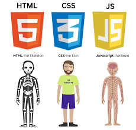

# Что такое JavaScript?
## JS: основные понятия
JavaScript, вероятно, является одним из самых важных языков программирования на сегодняшний день. Благодаря развитию веба JavaScript достиг высот, которых ему не сулили. В этой статье мы рассмотрим весь путь JavaScript от создания до сегодняшних дней и постараемся заглянуть в его будущее.

Современный JavaScript – это «безопасный» язык программирования общего назначения. Обычно используется как встраиваемый язык для программного доступа к объектам приложений. Наиболее широкое применение находит в браузерах как язык сценариев для придания интерактивности веб-страницам.

Язык программирования JavaScript был разработан фирмой Netscape в сотрудничестве с Sun Microsystems и анонсирован в 1995 году.

# Какие языки похожи на JS?
Его ещё называют главным языком фронтенда — «лицевой» стороны сайта, с которой взаимодействуют пользователи. JavaScript похож на Java, Python, Go, C#, но имеет свои особенности: 1. Интерпретируемый, а не компилируемый.

# Роль JavaScript в веб-разработке

# History
## Все началось в 90-е
События, в результате которых появился JavaScript, разворачивались в течение шести месяцев, с мая по декабрь 1995 года. Компания Netscape Communications уверенно прокладывала себе путь в области веб-технологий. Её браузер Netscape Communicator успешно отвоевывал позиции у NCSA Mosaic, первого популярного веб-браузера. Netscape была создана людьми, принимавшими участие в разработке Mosaic в ранние 90-е. Теперь, с деньгами и независимостью, у них было всё необходимое для поиска способов дальнейшего развития веб-технологий. Именно это послужило толчком для рождения JavaScript.

Основатель Netscape Communications и бывший участник команды Mosaic Марк Андриссен считал, что веб должен стать более динамичным. Анимации, взаимодействие с пользователями и другие виды интерактивности должны стать неотъемлемой частью интернета будущего. Веб нуждался в лёгком скриптовом языке (или языке сценариев — прим.ред.), способном работать с DOM, который в те дни не был стандартизирован. Существовало одно «но», являвшееся на тот момент серьёзным вызовом: этот язык не должен был предназначаться для крупных разработчиков и прочих людей, имевших отношение к инженерной стороне вопроса. Java в те дни уже активно развивалась и твёрдо заняла эту нишу. Таким образом, новый скриптовый язык должен был предназначаться для совершенно иной аудитории — дизайнеров. Очевидно, что веб был статичным, а HTML был достаточно молод и прост в освоении даже для тех, кто не имел ничего общего с программированием. Следовательно, всё, что должно было стать частью браузера и сделать веб более динамичным, должно быть максимально понятным для далёких от программирования людей. Из этого предположения родилась идея Mocha, который должен был стать тем самым простым, динамичным и доступным скриптовым языком.

 
Потом имя Mocha изменился на LiveScript в 1996 году,
за причины что в тот время язык Java был популярным они схитрили и резко изменили язык LiveScript на JavaScript. И тогда язык JavaScript быстро становился популярным и многим был известен,многим было интересно работать с языком JavaScript.

Первый официальный Standart языка JavaScripta ECMAscript,(ES1) был создан в 1997 году, это стандарт, JavaScript — язык на практике .
самое большое обновление языка за всю историюб выпущен ES6/ES2015 (ECMAScript 2015).

# JavaScript Data Types

# JavaScript Operators

## Ariphmetic -+,-,*,/%
## Comparison ==,===,>=,<=,!=,!==
## Logical &&, ||,  !
## Type conversion Number("3.14")
## Assigment =, +=, -=, *=, /=